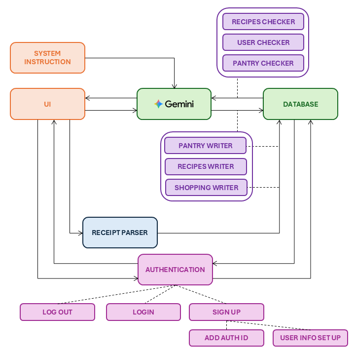

# <font color="#acc95b" size=6>**PROJECT ARCHITECTURE**</font>

<div style="border:2px solid #acc95b; padding: 15px; border-radius: 10px; background-color: #eef5dbff">

**Team Name:** *SmartBites*

**Project Name:** *SmartBites*

**Team Members:**  
- Beatriz Marques - 20231605  
- Constança Pereira da Silva - 20231720 
- Maria Inês Santos - 20231630  
- Mariana Calais-Pedro - 20231641  

**Project Domain:** Food & Meal Planning

</div><br>

<div style="border:2px solid #acc95b; padding: 15px; border-radius: 10px; background-color:#f9f9f9">

<font color='#acc95b' size=5>**TABLE OF CONTENTS**</font> <a id='toc'></a>

- [PART 1: PROJECT OVERVIEW](#part-1-project-overview)
- [PART 2: SYSTEM ARCHITECTURE](#part-2-system-architecture)
- [PART 3: DATA FLOW](#part-3-data-flow)
- [PART 4: DATA SCHEMA](#part-4-data-schema)
- [PART 5: ARCHITECTURE DECISIONS & TECHNICAL CHOICES](#part-5-architecture-decisions--technical-choices)
</div>

##  <font color="#acc95b" size=5>PART 1: PROJECT OVERVIEW</font>

### <font size=3>**THE PROBLEM WE ARE SOLVING**</font>
University students often face difficulties planning and preparing meals due to busy and unpredictable schedules. This frequently leads to repetitive meals, inefficient use of available ingredients, time-consuming planning, and increased food waste. *SmartBites* aims to simplify meal planning by helping users create practical meal plans and recipes based on the ingredients they already have, their time constraints, and their dietary preferences.

### <font size=3>**TARGET USERS**</font>
The primary users of *SmartBites* are university students who manage their own meals. These users typically have limited time, variable schedules, and a need for simple, flexible, and affordable meal-planning solutions.

### <font size=3>**CORE VALUE PROPOSITION**</font>
*SmartBites* transforms meal planning into a fast and stress-free process by providing personalized meal plans and recipe suggestions based on available ingredients, user preferences, and time constraints.

## <font color="#acc95b" size=5>PART 2: SYSTEM ARCHITECTURE</font><a class="anchor" id="2"></a>

<p align="left">
  
</p>

### <font size=3><span style="background-color:#acc95b; padding:4px 8px; border-radius:4px;">**UI LAYER**</font></span>

**Framework:** *Streamlit*  
**Purpose:** Provide an intuitive, conversational interface that allows users to upload grocery receipts, manage ingredients, and receive personalized meal suggestions.  


| Page / Screen                    | Purpose                                                                 |
|----------------------------------|-------------------------------------------------------------------------|
| Login / Signup Page              | Authenticate users and collect basic profile and dietary information.   |
| Chatbot Page | Interact with the AI assistant. |
| Receipt Analyzer Page  | Upload grocery receipts for automatic pantry updates. |
| Meal Planner Page                | Display weekly meal plans in a calendar view and allow inspection of planned recipes. |
| Pantry Page | Show pantry items with quantities.  |
| Shopping List Page | Show and manage the shopping list.         |
| Profile Page                     | View and edit user profile and dietary preferences.                     |

**User Inputs**
- File uploads (images or PDFs of receipts)  
- Text input (chatbot interaction, meal planning requests, pantry updates)  
- Dropdowns (dietary options, cuisine types)
- Checkboxes and toggles (shopping list)

**Display Outputs**
- Extracted structured data (pantry items, receipts)
- Chat conversations
- Tables (pantry, meal plans)
- Recipe details and cooking instructions


### <font size=3><span style="background-color:#acc95b; padding:4px 8px; border-radius:4px;">**SERVICE LAYER**</font></span>

**Implementation:** Python  
**Frameworks:** Internal Python modules invoked by *Streamlit*

The Service Layer represents the core business logic of *SmartBites*. It is implemented as a
single consolidated service, ***AIService***, which centralizes all AI orchestration, reasoning,
and workflow coordination.

This architectural decision was made deliberately to avoid duplicated logic, fragmented AI
calls, and inconsistent prompt handling across the application. By concentrating all AI-driven
behaviour in one service, the system ensures predictable outputs, easier debugging, and simpler
maintenance.

*AIService* functions as the orchestration hub between:

- *Streamlit* UI layer
- Google *Gemini* API
- Authentication context (user-scoped execution)
- Deterministic Tools Layer
- Persistence layer (*Supabase*, via tools)

**The Service Layer does not directly implement persistence logic. Instead, it invokes
deterministic tools that encapsulate database access and domain-specific operations.**

#### <font size=3>**AI PLATFORM**</font>

**LLM Provider:** Google *Gemini* (*Gemini* 2.5 Flash)

*Gemini* is used exclusively for reasoning, natural language understanding, and content generation.
All side effects (database reads/writes) are executed through explicit tool calls, ensuring that
the backend remains deterministic and auditable.

#### <font size=3>**RESPONSABILITIES**</font>

The Service Layer (*AIService*) is responsible for:

- Managing all interactions with the Google *Gemini* API
- Creating and maintaining authenticated, multi-turn chat sessions
- Applying global system instructions consistently across all AI calls
- Handling multi-turn conversational flows for:
  - Meal planning
  - Grocery and pantry management
  - Cooking assistance
- Translating natural language user intent into deterministic tool invocations
- Coordinating workflows such as:
  - Receipt parsing and pantry updates
  - Meal plan generation and approval
  - Recipe storage and retrieval
  - Shopping list synchronization
- Extracting structured data from grocery receipts (item name, quantity, price, store, date)
- Generating AI-driven content, including:
  - Recipes
  - Step-by-step cooking instructions
  - Feedback and clarification messages
- Ensuring all AI actions are scoped to the authenticated user context
- Centralizing observability, tracing, and debugging of AI operations via *Langfuse*

#### <font size=3>**CONVERSATIONAL MANAGEMENT**</font>

**Multi-turn conversations:** Yes  

*AIService* maintains conversational state for meal planning, dietary guidance, and grocery
organization while keeping the backend stateless. Context is reconstructed per request using
authenticated user data retrieved through tools.

#### <font size=3>**DESIGN RATIONALE**</font>

- Centralized AI orchestration prevents inconsistent reasoning and duplicated prompt logic
- Clear separation between reasoning (*AIService*) and side effects (Tools Layer)
- Deterministic tools ensure reproducibility and safe database operations
- Single service simplifies observability, debugging, and future scaling
- Architecture remains compatible with future extraction into a standalone API service

### <font size=3><span style="background-color:#acc95b; padding:4px 8px; border-radius:4px;">**TOOLS LAYER**</font></span>

| **Tool** | **Purpose** |
|-----------|--------------|
| **User Checker** | Retrieves profile/dietary data for AI use | 
| **Pantry Checker** | Returns pantry items in consistent, human-readable formatting |
| **Pantry Writer** | Insert pantry entries (from receipts or user input) and removes consumed items |
| **Recipe Checker** | Fetches recently cooked recipes to reduce repetition |
| **Recipe Writer** | Writes/updates/deletes recipes with user approval |
| **Shopping List Writer** | Writes missing ingredients and reconciles receipt updates |
| **Cooking Assistant** | Provide structured cooking guidance without databse mutation |
| **Seasonal Finder** | Identifies the current season to fit recipe suggestions |

## <font color="#acc95b" size=5>PART 3: DATA FLOW</font>

### <font size=3><span style="background-color:#acc95b; padding:4px 8px; border-radius:4px;">**AUTHENTICATION**</font></span>

**Trigger**: New user signup or existing user login

- **SignUp**: UI collects email & password $\rightarrow$ validates input $\rightarrow$ stores credentials securely in Supabase auth table $\rightarrow$ creates user profile in database.
- **Login**: UI collects credentials $\rightarrow$ verifies against database $\rightarrow$ grants access to AI Chatbot page upon success.

### <font size=3><span style="background-color:#acc95b; padding:4px 8px; border-radius:4px;">**RECEIPT PROCESSING**</font></span>

**Trigger**: User uploads a receipt image

- UI sends receipt to Service Layer $\rightarrow$ validated $\rightarrow$ passed to *Gemini* for text extraction $\rightarrow$ structured items are normalized $\rightarrow$ inserted into pantry table.

### <font size=3><span style="background-color:#acc95b; padding:4px 8px; border-radius:4px;">**PANTRY, MEAL PLAN & SHOPPING MANAGEMENT**</font></span>

**Trigger**: User actions like generating meal plans, adding/consuming ingredients, or updating shopping lists

- **Meal Plan**: *Gemini* queries pantry, preferences, and recent recipes $\rightarrow$ generates proposed plan $\rightarrow$ highlights missing items $\rightarrow$ UI presents suggestions $\rightarrow$ approved plan stored; missing items added to shopping list.

- **Pantry Updates**: *Gemini* updates pantry levels based on user input or consumption $\rightarrow$ suggests replacements if ingredients run low.

- **Shopping List**: Items added/removed manually or automatically $\rightarrow$ stored in database $\rightarrow$ reconciled with future receipts.


### <font size=3><span style="background-color:#acc95b; padding:4px 8px; border-radius:4px;">**COOKING HELPER**</font></span>

**Trigger**: User asks a cooking or technique question

*Gemini* provides step-by-step guidance via UI; no database changes.

### <font size=3><span style="background-color:#acc95b; padding:4px 8px; border-radius:4px;">**FETCHING USER DATA**</font></span>

**Trigger**: User requests pantry contents or meal plan

*Gemini* retrieves requested data via Tools Layer $\rightarrow$ presents in clear, human-readable format $\rightarrow$ database remains unchanged.

## <font color="#acc95b" size=5>PART 4: DATA SCHEMA</font>

<font size=3><span style="background-color:#acc95b; padding:4px 8px; border-radius:4px;">**STRUCTURED DATA EXTRACTED**</font></span>

```json
{

  "user": {
    "full_name": "string",
    "birth_date": "date",
    "gender": "string",
    "household_number": "integer",
    "restrictions": ["string"], 
    "diet_type": ["string"],
    "cuisine_type": ["string"]
  },

  "pantry_items": {
    "ingredient_name": "string",
    "quantity": "float",
    "store_name": "string",
    "purchase_date": "date"
  },

  "recipes": {
    "recipe_date": "date",
    "recipe_name": "string",
    "ingredients": ["string"],
    "instructions": "string",
    "meal_type": "string", 
    "meal_date": "date", 
    "link": "string" 
  },

  "shopping_list": {
    "ingredient_name": "string", 
    "quantity": "float"
  }

}
```

## <font color="#acc95b" size=5>PART 5: ARCHITECTURE DECISIONS & TECNICAL CHOICES</font>

| **Decision** | **Rationale** |
|---------------|---------------|
| **Streamlit for UI** | Rapid prototyping and interactive AI integration |
| **Python (modular structure)** | Familiar language for team; strong ecosystem |
| ***Gemini* API** | Native multimodal capabilities for text + image (receipt parsing) |
| **Database (*Supabase*)** | Simple to implement and sufficient for prototype stage |
| **Function Calling for Tools** | Enables modular AI-tool interaction |
| **Streamlit Cloud Deployment** | Free hosting, easy sharing, integrated secrets management |
| **Langfuse Integration** | Adds tracing and performance monitoring for LLM calls |
